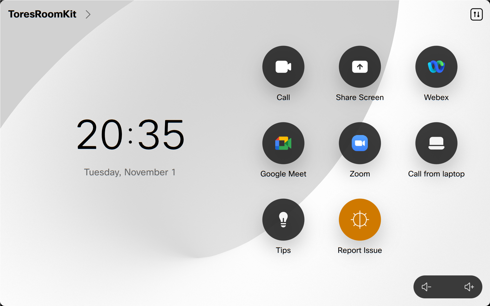
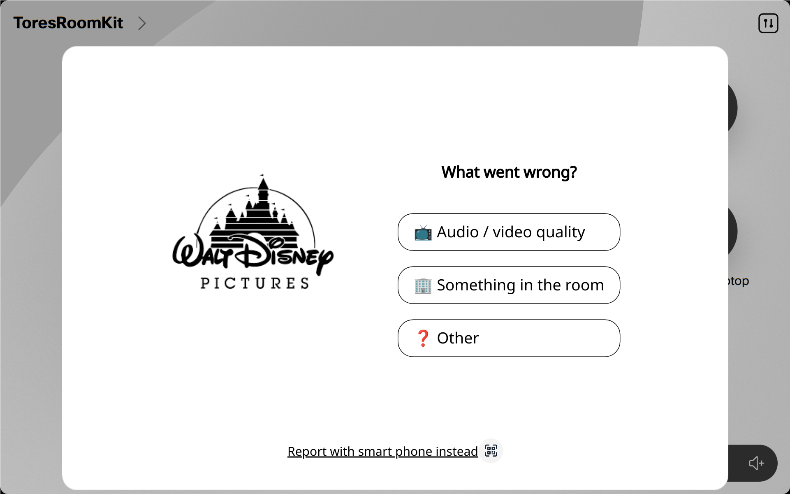
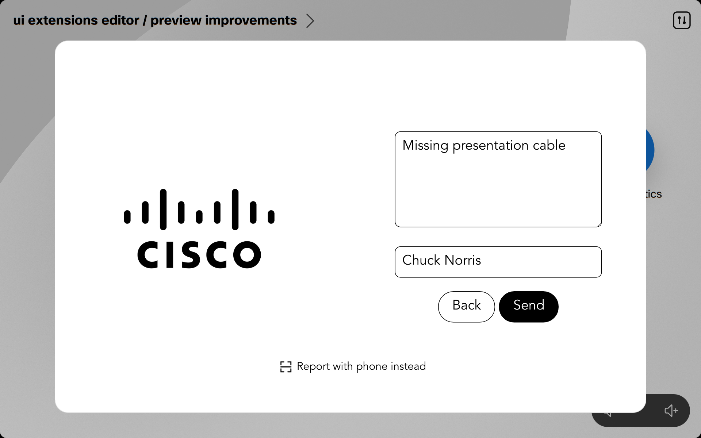
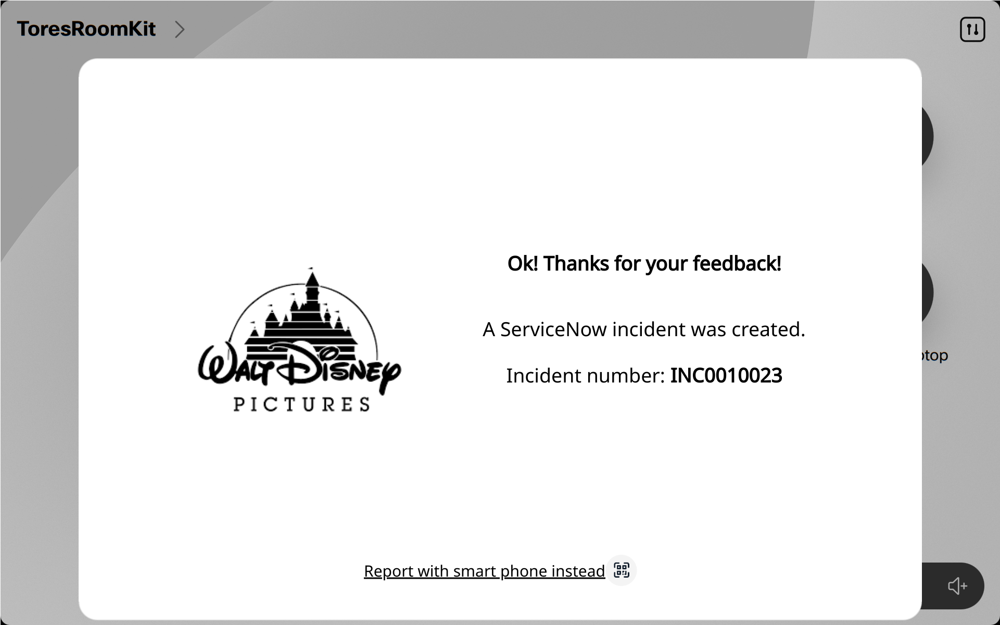
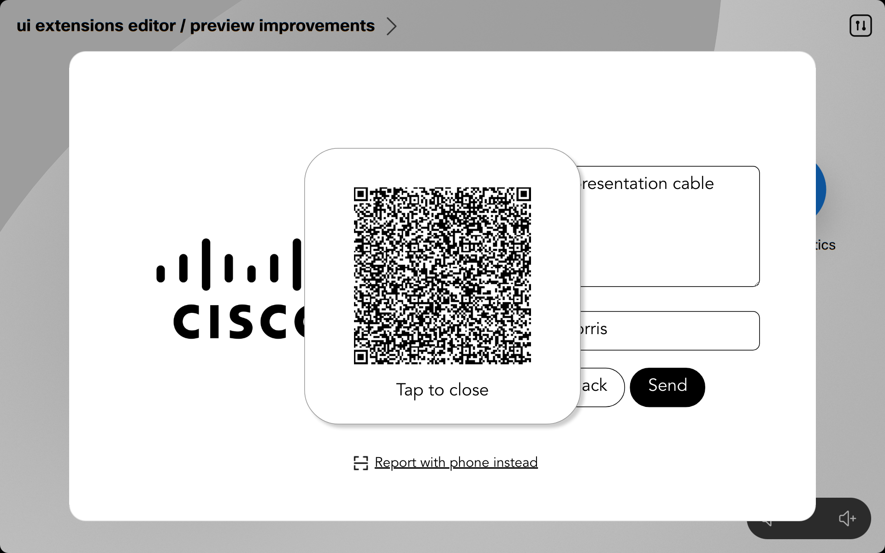

# Report issue Web Dialog

Report issue to Service Now with a web based dialog on a Cisco Room Navigator.

## Background

There are already many examples of macros and UI extensions for reporting issues from a room with a Webex device to REST based services such as ServiceNow. This example uses a hosted web view instead. This provides a couple of interesting opportunies:

- More advanced flows and UI elements than the basic RoomOS dialogs can offer
- Branding
- QR code to register with smart phone instead

## Flow

## Requirements

* RoomOS/CE 11 or above Webex Device with a Room Navigator paired (direct or remote)
* Web admin access to the device to uplaod the macro and UI extension
* Admin crentials for a ServiceNow instance.
* Network connectivity for your Webex Device to make HTTP POSTs directly with the ServiceNow APIs.

## Setup Service Now

If you are not already a Service Now user, it can be a bit overwhelming. Among other things it let's you create your owna tables, apps etc. But this demo just uses the 'Incidents' app, which is a built-in one, and you don't need to setup much in Service Now.

Steps:

* Create a development user at developer.servicenow.com
* Create a free developer instance
* Note down the instance id, the username and password

That's the basics. The incident table automatically exists in the instance, as well as REST APIs for adding incidents. However, to allow the web view to talk directly to Service Now, you also need to setup CORS rules:

* Select All from the instance menu, search for CORS rules and select it
* Select New to create a new rule
* Add the following details:
  * Name: Github RoomOS
  * REST API: Table API [now/table]
  * Domain: https://cisco-ce.github.io
* Save

You may also want to repeat this for `http://localhost:<port>` if you want to test this in your own development environment.

## Why a macro if we use a web view

The macro is required for several reasons:

* A web dialog cannot currently be installed, only launched from xAPI
* Web content can't access the xAPI - so data such as room/device name etc is provided by the macro as URL parameters
* The macro stores the web service credentials (ServiceNow password etc)

## Setup video device

* Add the macro and the UI extension from the `macro-uiexntsions/` folder to your video device
* Enable the macro
* Tap the `Report Issue` button on your Navigator home screen

## Support

Contact Tore Bjolseth at Cisco (Collaboration Technology Group, Norway).
