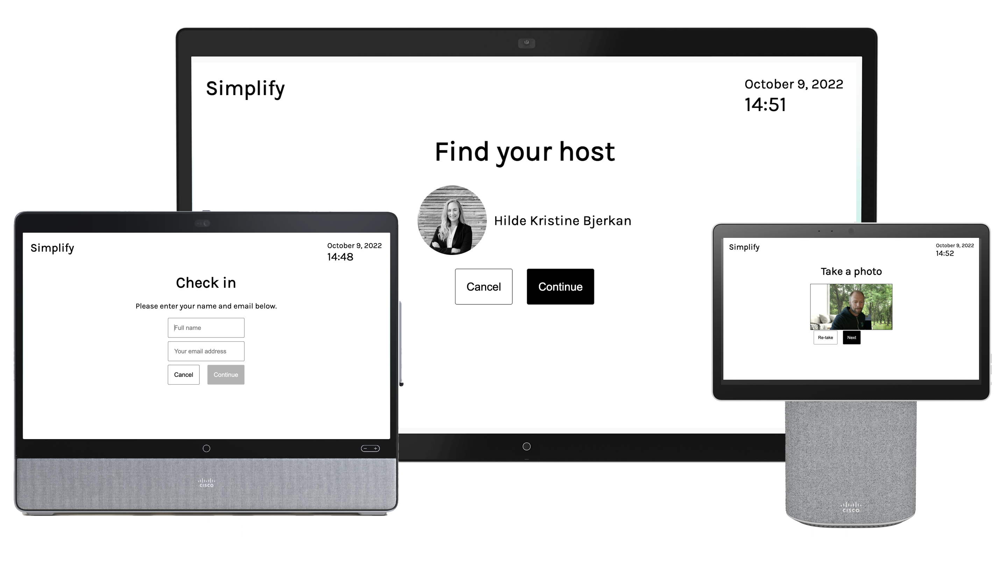

# Webex Visitor Kiosk

This is a working demo of how the Webex devices can be used for visitor registration in lobbies and receptions. The kiosk let's a user walk up and register themselves. A Webex message is then sent to the host.

It is meant as a demo to illustrate how the user experience will be like, but it can easily be extended or used as a basis for your own visitor registration if you want. Just fork the Git repository and go wild with it.

## Features

* Recommended usage is **kiosk mode**, where the rest of the RoomUI is hidden, for a focused user experience
* Allows user to search the Webex org to tell which host they are visiting
* Photo booth with camera access, so host can see who is visiting
* The kiosk sends a message with name as well as photo of the visitor

## Real-life usage

If you want to use a visitor kiosk in a real-life situation, you typically also need:

* To save the registration from the kiosk to your company's offical registration system
* To print a badge for your visitor

The kiosk can easily be extended to do this. Since every company typically has their own system for this, you will need to make this particular glue code yourself.

## Requirements

The typical device to use for a kiosk is a device with touch screen such as:
* Cisco Desk Pro or Desk
* Cisco Desk Mini
* Admin access to the device, either local admin access or through Control Hub

It's also possible to use a Cisco Board, but it might be a bit too large for the use case.

## Bot token to search for hosts

To allow the kiosk to search your organisation for hosts, you need a bot in that organisation. This is very simple, a bot is just a generic and can be created on developer.webex.com in a few minutes:

* Go to [developer.webex.com](https://developer.webex.com)
* Log in
* Tap your own profile in the top right corner, select My Webex Apps
* Create new app > Create a Bot
* Fill in the bot details as you wish, for example
  * Bot name: Visitor Bot
  * Bot username: visitorbot
  * Find an icon you like
  * Save
  * Copy the bot access token. You will use this in the kiosk to search for hosts.

That's it. Keep the bot access token somewhere safe. If you loose it, you can just go to [developer.webex.com](https://developer.webex.com/my-apps) again and re-generate a token.

## Setup the kiosk on a Cisco video device

There are three ways you can provide a kiosk on your Cisco device:

1. In kiosk mode
2. As digital signage
3. As a web app

◊
Requirements
- desk pro, desk, desk mini. possibly board

How to set up
- Url
- Setting as signage. office hours
- Configure: disable assistant, ultrasound pairing. enable wake on motion
- Settings as kiosk
- Give media access
- Add bot
  - How to create bot

Connecting to printer, corporate visitor system

Misc: replacing webex for host search and messages (create interception point)